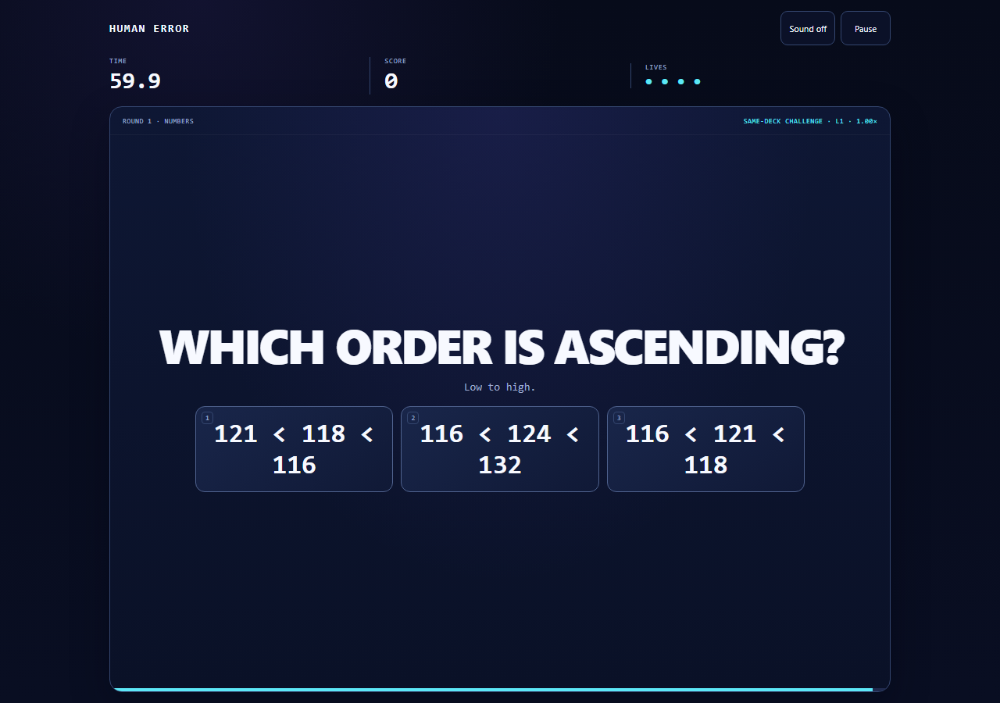

# HUMAN ERROR

**Fast hands. Questionable decisions.**

HUMAN ERROR is a one-screen microgame rush about reading carefully while the game keeps changing what “carefully” means. Find the impostor. Save production. Remember the code. Wait for GO. Do not press the extremely pressable button.

Built for **Hackyard Yard #3 — One Screen**: the entire game, results, leaderboard and mode flow stay inside one view. No routed second page is required.

**v0.7.0 · ruleset 7 · 132 mission templates · MIT**

## Why it is different

- **132 bounded mission templates across five categories**, selected without template repetition inside a run.
- **One deterministic referee** owns timing, grading, streaks, lives and scoring; the renderer does not decide truth.
- **Three ways to play:** adaptive 60-second runs, fixed seeded challenges and untimed practice.
- **Optional shared leaderboard with server replay:** the server recomputes ranked Adaptive results from bounded input events instead of trusting a client-submitted score.
- **Portable release:** offline play is one self-contained `dist/index.html` file with zero runtime packages.
- **Reproducible release tooling:** TypeScript `5.8.3` and Bun `1.4.0` are lockfile-pinned development dependencies.

The director is deliberately rule-based. No cloud model, analytics SDK, ad SDK or third-party gameplay service runs during play.

## Release snapshot

| Check | v0.7.0 release result |
| --- | --- |
| Node test suite | **88/88 PASS** |
| Generator contract sweep | **132 templates × 1,000 seeds PASS** |
| New v0.7 visible-answer oracles | **50 templates × 1,000 seeds PASS** |
| Empty/undefined-choice invariant scan | **264,000 generated instances PASS** |
| Exact desktop all-mission browser run | **132/132 settled correctly: 131/131 graded correct + 1 neutral setup, deck finished, 0 repeats, 0 JS errors** |
| Exact 360×640 touch run | **132/132 settled correctly: 131/131 graded correct + 1 neutral setup, deck finished, 0 repeats, 0 overflow failures, 0 JS errors** |
| Timed Adaptive qualification | **60,000 ms active play, 80/80 graded correct, score 53,452, Level 4, 1.39× max tempo, replay accepted, exact browser/server score parity** |
| Static release audit | **PASS** |
| Runtime npm dependencies | **0** |
| Release artifact | **103,057 raw / 38,360 gzip bytes** |
| Artifact SHA-256 | `b3e5934fadb5cd4a72396f309b399b0ca75b5252bcd55a87322e85037dcee1b5` |

The size gate remains strictly below **124 KiB raw / 39 KiB gzip**. Full evidence, commands and limitations are in [QA](docs/QA.md) and [launch readiness](docs/LAUNCH_READINESS.md).

## Play

### Fastest path: offline

Open `dist/index.html` in a current browser. That is the exact standalone release artifact. It needs no account, API key, install or network connection.

Offline play includes the complete game. The shared leaderboard is intentionally unavailable without the included Node service.

### Run from source

Requirements: **Node.js 22+** and npm.

~~~sh
git clone https://github.com/Smkzz/humanerror.git
cd humanerror
npm ci
npm run check
npm run serve
~~~

Then open the loopback URL printed by the server, normally `http://127.0.0.1:4173`.

`npm ci` installs the exact lockfile-pinned build tools. The project explicitly allows Bun `1.4.0`'s installer under npm's strict script policy; the build then invokes only the local TypeScript and Bun executables and never falls back to global tools.

### Full browser qualification

Python 3.10+ and Playwright are development-only requirements:

~~~sh
python -m pip install -r tests/requirements.txt
python -m playwright install chromium
npm run test:browser
~~~

Browser emulation is useful coverage, not a claim of physical-device or universal-browser certification.

## Game modes

| Mode | Contract |
| --- | --- |
| **Adaptive** | 60 seconds of active task time, four lives, rule-based local adaptation and pacing. Eligible unassisted runs can be server-replayed for the shared board. |
| **Challenge** | Fixed seeded deck with the same mission parameters and limits for the same seed. Unranked and shareable. |
| **Practice** | Ten graded tasks without answer deadlines or lives. Unranked. |

Challenge links are bound to ruleset **7**. Older ruleset links fail closed rather than silently becoming a different challenge.

A mission template is selected at most once per run. Feedback, the input guard and pauses do not consume the 60-second active-play budget. Neutral setup screens and an unfinished final task are not counted as failed answers.

### Controls

Use click/touch or **1–9** for visible options. Typing missions support the keyboard plus the on-screen keys. **Backspace** edits and **Enter** submits. Reaction/wait mechanics use **Space** or **Enter** for the displayed action. **P** pauses except while typing. Audio is optional and starts off.

The game auto-pauses on tab hide, focus loss or an extended scheduling interruption. An assisted/paused Adaptive run is not eligible for the shared board.

## Architecture

~~~text
seed + mode
    │
    ▼
director ── chooses an unused mission
    │
    ▼
generator ── creates a bounded deterministic round
    │
    ▼
engine/referee ── timing · grading · streak · lives · score · receipts
    │
    ├──────────────► browser renderer / keyboard / touch
    │
    └─ ranked run events ─► one-use session ─► server replay ─► leaderboard
~~~

The browser and server replay the same compiled referee rules. Ranked submissions contain bounded input events, not an authoritative score. The server binds a one-use session to the exact game version/ruleset, validates timing and transcript structure, replays the run, computes the result and only then considers leaderboard persistence.

The standalone browser artifact is bundled as a minified IIFE with the pinned Bun build dependency. The generated page contains one inline stylesheet and one inline script, both covered by exact Content Security Policy hashes.

See [architecture](docs/ARCHITECTURE.md) for the trust and timing boundaries and [mission catalogue](docs/MISSION_CATALOGUE.md) for all 132 templates.

## Security model

The shared board is designed for a **casual public playtest**, not for prize-money anti-cheat.

Implemented boundaries include:

- same-origin JSON mutation requests;
- exact version/ruleset checks;
- cryptographically shaped, short-lived, one-use run sessions;
- bounded request bodies and transcripts;
- immediate rejection/connection close when a streaming body crosses the 64 KiB cap;
- server-side deterministic replay and timing plausibility checks;
- no trust in client-supplied score fields;
- bounded fixed-window request limits;
- atomic persistent score writes with corruption quarantine;
- build provenance checks before the server listens;
- strict CSP, no runtime eval, no third-party scripts/styles and zero runtime npm packages;
- runtime/player data excluded from Git.

This does **not** prove a human played, prevent an automated modified client from generating valid actions, verify player identity or provide account recovery. Read [SECURITY.md](SECURITY.md) before exposing the service publicly.

## Shared-board deployment

`npm run serve` defaults to loopback and stores local board data under ignored `.runtime-v7/`.

For a hosted playtest:

1. Build and run `npm run check` on the exact source you intend to serve.
2. Put the Node service behind a same-origin **TLS reverse proxy**.
3. Set a persistent writable `DATA_DIR`.
4. Set `HOST=0.0.0.0` only behind that proxy.
5. Set `TRUST_PROXY_HOPS` only when you know the exact trusted proxy chain.
6. Start with one application process. Run sessions and rate-limit buckets are process-local.

Operational details and residual risks are documented in [launch readiness](docs/LAUNCH_READINESS.md).

## Scoring

A correct graded answer scores:

~~~text
(100 + speed bonus) × streak multiplier
~~~

The speed bonus is 0–100 from remaining task time. It is zero in Practice and on mechanics where the correct action is simply waiting. The multiplier is ×1 for streaks 1–3, ×2 for 4–6, ×3 for 7–9 and ×4 from 10 onward. A failed graded task resets the streak. Surviving Adaptive adds a one-time 1,000-point bonus while at least one life remains.

The engine records deterministic receipts used by replay and tests. They are diagnostic evidence, not signed proof that a human played.

## Repository map

~~~text
src/        referee, generators, scheduler, profile and browser client
scripts/    build, audit, replay verifier, sessions, storage and HTTP service
tests/      deterministic, property/invariant, persistence, HTTP and browser tests
dist/       exact standalone release, security headers and manifest
docs/       architecture, mission catalogue, QA, playtest and release notes
qa/         versioned receipts and selected screenshots
.github/    continuous integration and contribution templates
~~~

## Contributing

Start with [CONTRIBUTING.md](CONTRIBUTING.md). Changes to grading, timing, scoring or mission contracts require deterministic tests. New missions need an independent answer oracle, accessible keyboard/touch input and catalogue documentation.

Useful commands:

~~~sh
npm run typecheck
npm run check
npm run verify:evidence
npm run test:browser
~~~

Security issues should follow [SECURITY.md](SECURITY.md), not a public issue.

## Demo and competition material

The repository includes a judge-focused [demo video plan and shot list](docs/DEMO_VIDEO.md) plus a ready-to-paste [Hackyard submission pack](docs/HACKYARD_SUBMISSION.md). The demo is intentionally gameplay-first: the opening seconds show the core trap, then real interaction, mission variety, memory, the server-replayed result and only a short engineering proof section.

## License

HUMAN ERROR is released under the [MIT License](LICENSE).

## Scope and limitations

The release evidence supports the exact artifact and tested environments described above. It is **not** an independent security certification, anti-bot system, identity system, cognitive assessment, universal browser certification or proof of production-scale operations. Fresh-player comprehension/fun and physical-device behavior still benefit from real human playtesting.
