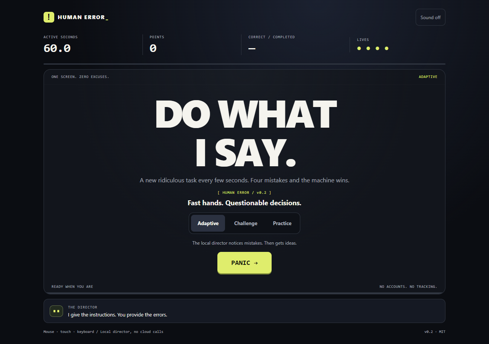

# HUMAN ERROR

**Fast hands. Questionable decisions.**

A one-screen microgame rush. Find the impostor. Save production. Remember the code. Do not press the extremely pressable button.

The director has a sense of humor. The referee does not.



## Play

Open **`dist/index.html`** in a modern browser. No account, install, API key or internet connection is needed once you have the file. The same artifact works on a normal static HTML host. It does not need Supabase, a database or a serverless function.

- **Adaptive:** 60 seconds of active play, four lives, a locally adapting task scheduler.
- **Challenge:** a fixed seeded deck with identical template parameters and limits at each ordinal. No personalized scheduling. Share the seed via “Challenge a friend.”
- **Practice:** ten graded tasks without answer deadlines or lives. Memory setup and feedback advance manually. Wait tasks still reward waiting; reaction tasks wait indefinitely for a response after GO.

The 60-second budget measures active task time, not wall time. Feedback, the short input guard, and pauses do not consume it. A full run consequently lasts longer than 60 wall-clock seconds. “Correct / completed” counts only settled, graded questions. Setup screens and an unfinished last question are not failures.

### Controls

Click/tap an answer, or press **1–9** for the corresponding option. On spelling tasks, type letters, use **Backspace**, and press **Enter**, or use the on-screen keys. On reaction/wait tasks **Space** or **Enter** presses the displayed button; that is deliberately a mistake when the rule says not to press it. **P** pauses except while typing. You can always use the visible Pause button. Audio starts off and is optional.

The game auto-pauses on tab hide, lost focus, or a large scheduling interruption. Paused runs are labelled and do not update the adaptive personal best. Scores are casual, local and unverified. This is not a secure competitive leaderboard.

## Build and test

Node.js 22 or newer is the tested toolchain family. TypeScript **5.8.3** is pinned in the lockfile; there are **zero runtime dependencies**.

```sh
npm ci --ignore-scripts
npm run check
npm run serve
```

The development server prints the local URL (default `http://127.0.0.1:4173`). It serves only the built page and manifest and binds to loopback. It is not a production hosting service.

`npm run check` compiles with strict TypeScript, runs Node's built-in tests, and validates CSP hashes, unsafe-sink exclusions and size budgets. The build creates both compiled ESM for tests and a portable single-page release using TypeScript's AMD output with a small static module loader. There is no runtime `eval`, no dynamic import rewriting, and no CDN dependency.

### Browser tests

Python 3.10+ and Playwright are development-only requirements:

```sh
python -m pip install -r tests/requirements.txt
python -m playwright install chromium
npm run test:browser
```

The test suite normally loads the exact artifact into a real browser document, plays all ten practice questions using an independent visible-text answer oracle, checks 10/10, and reviews the receipts. To exercise an actual HTTP URL on your machine:

```sh
python tests/browser_test.py --url http://127.0.0.1:4173/
```

`CHROMIUM_PATH` can select an installed Chromium executable. Browser emulation is not a replacement for a physical-phone test. See [QA notes](docs/QA.md) for exactly what has and has not been tested.

## Scoring contract

Each completed correct answer scores `(100 + speed bonus) × multiplier`.

The speed bonus is 0–100, based on remaining task time; it is zero in practice and on tasks whose correct action is simply waiting. The multiplier is ×1 for streaks 1–3, ×2 for 4–6, ×3 for 7–9, and ×4 from 10 onward. A failed graded task resets the streak. Neutral setup does not change it. Surviving the timed mode adds 1,000 points **once**, only while at least one life remains.

Ten correct answers are **10/10 and 100%**, not “10 divided by every screen the UI happened to display.” Every counted answer has a receipt containing the exact instruction, expected answer, submitted answer, elapsed task time, verdict, and points. The result screen lets you inspect each one or export a local JSON audit.

## Is this an AI model?

No cloud model runs during gameplay. The director is a small, transparent **rule-based adaptive scheduler**. It tracks attempts and failures by category, uses a smoothed failure rate, preserves variety, and supplies a recovery task after a mistake. Fixed-deck Challenge mode disables personalization. The sarcastic lines are written content, not psychological assessments. This distinction is intentional: deterministic answer checking must never be delegated to an LLM.

## Project structure

```text
src/
  engine.ts       Authoritative referee, timing and receipts; no DOM
  games.ts        Thirteen bounded generators: twelve graded, one setup
  director.ts     Reproducible scheduling, adaptation and recovery beats
  random.ts       Seeded non-cryptographic game randomness
  challenge.ts    Bounded challenge links and optional preference parsing
  app.ts          DOM presentation, keyboard/touch input and lifecycle
  audio.ts        Opt-in synthesized cues
  types.ts        Shared strict contracts
site/             HTML shell and styles
scripts/          Portable build, allowlisted dev server and static audit
tests/           Deterministic regression/generator tests and browser tests
dist/            Exact standalone release plus hash/size manifest
docs/            Plan, architecture, security, QA and playtest gates
qa/              Test receipts and screenshots (local evidence, not badges)
```

## Open source and contribution

MIT licensed. No proprietary artwork, font files, generated image assets or game APIs are required. TypeScript and browser automation tools retain their own licences and are not bundled into the game. The source package is ready for a dedicated public repository; this release does not silently publish into unrelated projects.

See [CONTRIBUTING.md](CONTRIBUTING.md), [SECURITY.md](SECURITY.md), and the [initial plan](docs/PLAN.md). To add a game, add a typed generator, an independently checked correct-answer test, and an accessible input path. Never alter scoring from the renderer.

## Not claimed

No guaranteed “10/10 fun” rating, human cognitive diagnosis, verified global scores, universal browser certification, independent security audit, or tested public production deployment. Fun, humor and difficulty still need fresh-player playtests.
