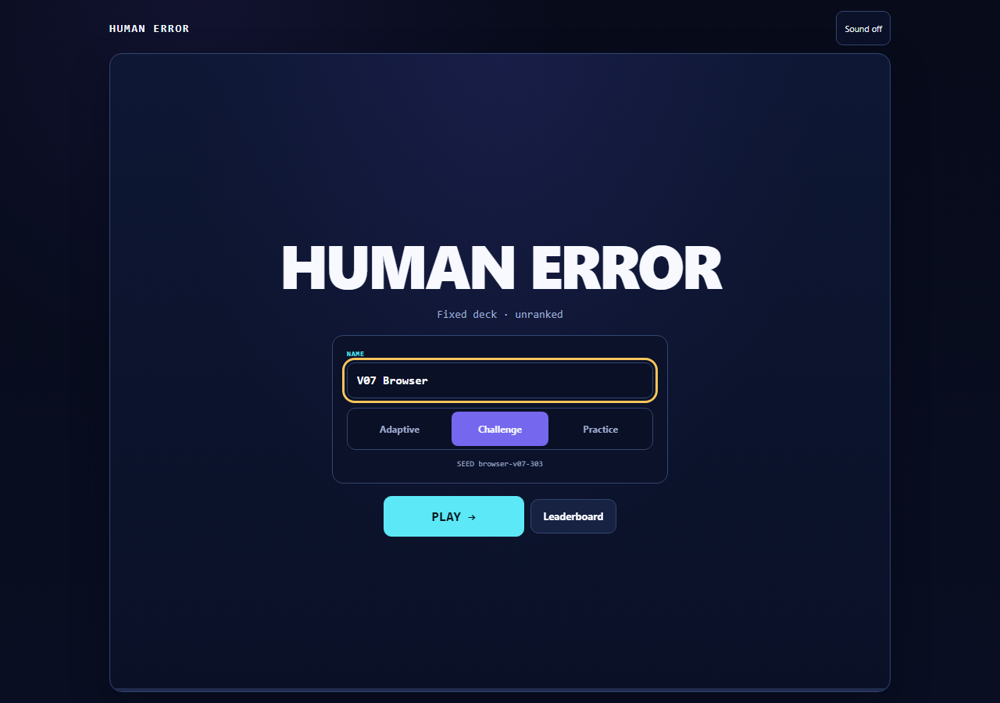
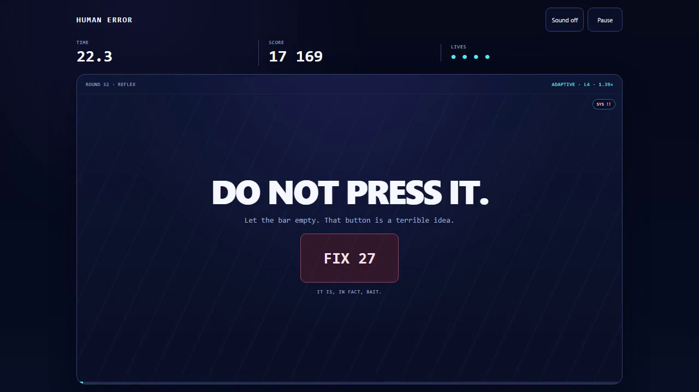
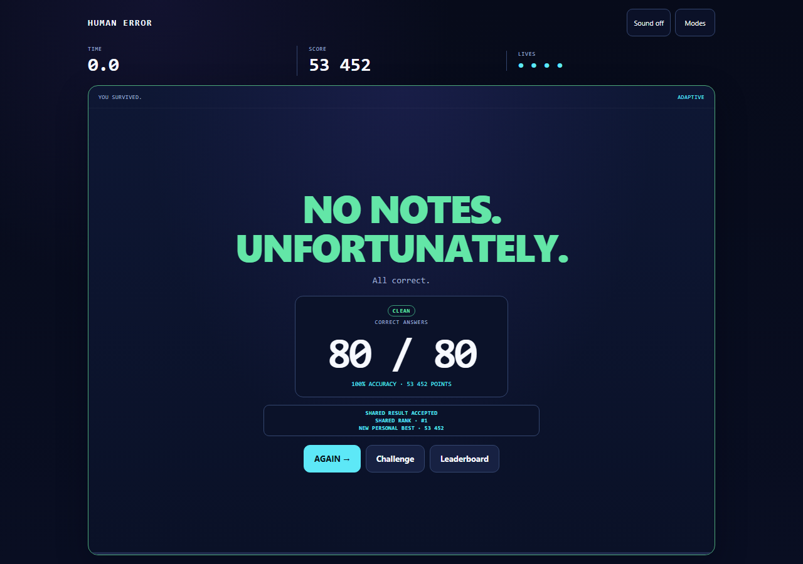

# HUMAN ERROR

**60 seconds. 132 missions. The rules keep changing.**

**v0.7.0 · ruleset 7 · MIT · zero runtime npm dependencies**

**[▶ Play now](https://smkzz.github.io/humanerror/)** · **[▶ Watch the 62s trailer](https://github.com/Smkzz/humanerror/releases/download/v0.7.0/human-error-v0.7.0-hackyard-winner.mp4)** · **[↓ Download the standalone HTML](https://github.com/Smkzz/humanerror/releases/download/v0.7.0/human-error-v0.7.0.html)**

HUMAN ERROR is a one-screen microgame rush about reading carefully under pressure while the game keeps changing what “carefully” means. Spot the pattern. Remember the code. Track the swaps. Wait for GO. Sometimes the correct move is doing absolutely nothing.

**Who it is for:** players who like fast logic/reflex challenges, reviewers judging the shipped build, and developers interested in deterministic browser games and replay-verified scoring.

v0.7.0 launched for **Hackyard Yard #3 — One Screen**, but the game is a standalone open-source release: the full game, results and mode flow stay inside one view with no routed second page.

## Quick start

The fastest path is the hosted standalone build:

**https://smkzz.github.io/humanerror/**

The hosted page is byte-for-byte the v0.7.0 standalone artifact. Gameplay works without an account; the optional shared leaderboard service is not attached to the static GitHub Pages deployment.

To run from source:

~~~sh
git clone https://github.com/Smkzz/humanerror.git
cd humanerror
npm ci
npm run serve
~~~

Requirements: **Node.js 22+** and npm. The server prints the loopback URL, normally `http://127.0.0.1:4173`.

For completely offline play, open `dist/index.html` directly or download the single-file release linked above.

## What it looks like

| Lobby | One of the traps | Replay-verified result |
| --- | --- | --- |
|  |  |  |
| Choose Adaptive, Challenge or Practice without leaving the screen. | Sometimes the obvious button is bait. | Ranked Adaptive runs can be recomputed from bounded input events. |

**Release proof at a glance:** 88/88 Node tests · 132/132 desktop mission sweep · 132/132 360×640 touch sweep · 80/80 timed Adaptive qualification · Level 4 / 1.39× · exact browser/server replay parity · zero runtime npm packages.

## Why it is different

- **132 bounded deterministic mission templates** across attention, numbers, words, memory and reflex.
- **One referee owns truth:** timing, grading, lives, streaks and scoring live in the deterministic engine, not the renderer.
- **Three modes:** a 60-second Adaptive run, fixed seeded Challenges and untimed Practice.
- **Replay-verified ranked runs:** the optional server recomputes a result from bounded input events instead of trusting a client-submitted score.
- **Portable release:** the complete offline game is one self-contained HTML file.
- **No model in the gameplay loop:** no cloud AI, analytics SDK, ad SDK or third-party gameplay service runs during play.

## Play and controls

### Modes

| Mode | Contract |
| --- | --- |
| **Adaptive** | 60 seconds of active task time, four lives, local rule-based adaptation and pacing. Eligible unassisted runs can be server-replayed for the shared board. |
| **Challenge** | Fixed seeded deck with the same mission parameters and limits for the same seed. Unranked and shareable. |
| **Practice** | Ten graded tasks without answer deadlines or lives. Unranked. |

Challenge links are bound to ruleset **7**. Older ruleset links fail closed rather than silently becoming a different challenge.

A mission template is selected at most once per run. Feedback, the input guard and pauses do not consume the 60-second active-play budget. Neutral setup screens and an unfinished final task are not counted as failed answers.

### Controls

Use click/touch or **1–9** for visible options. Typing missions support the keyboard plus on-screen keys. **Backspace** edits and **Enter** submits. Reaction/wait mechanics use **Space** or **Enter** for the displayed action. **P** pauses except while typing. Audio is optional and starts off.

The game auto-pauses on tab hide, focus loss or an extended scheduling interruption. An assisted/paused Adaptive run is not eligible for the shared board.

## Release evidence

Detailed proof is deliberately below the play path. Full commands, raw receipts and limitations live in [QA](docs/QA.md) and [launch readiness](docs/LAUNCH_READINESS.md).

| Check | v0.7.0 release result |
| --- | --- |
| Node test suite | **88/88 PASS** |
| Generator contract sweep | **132 templates × 1,000 seeds PASS** |
| Visible-answer oracle sweep | **50 templates × 1,000 seeds PASS** |
| Empty/undefined-choice invariant scan | **264,000 generated instances PASS** |
| Exact desktop all-mission browser run | **132/132 settled correctly; 0 repeats; 0 JS errors** |
| Exact 360×640 touch run | **132/132 settled correctly; 0 overflow failures; 0 JS errors** |
| Timed Adaptive qualification | **60,000 ms active play; 80/80 correct; score 53,452; Level 4; 1.39×; replay accepted; exact score parity** |
| Static release audit | **PASS** |
| Runtime npm dependencies | **0** |
| Release artifact | **103,057 raw / 38,360 gzip bytes** |
| Artifact SHA-256 | `b3e5934fadb5cd4a72396f309b399b0ca75b5252bcd55a87322e85037dcee1b5` |

The artifact remains below the strict **124 KiB raw / 39 KiB gzip** gate. GitHub Pages was separately verified to serve the same 103,057-byte artifact with the same SHA-256.

### Full browser qualification

Python 3.10+ and Playwright are development-only requirements:

~~~sh
python -m pip install -r tests/requirements.txt
python -m playwright install chromium
npm run test:browser
~~~

Browser emulation is useful coverage, not a claim of physical-device or universal-browser certification.

## Architecture

~~~text
seed + mode
    │
    ▼
director ── chooses an unused mission
    │
    ▼
generator ── creates a bounded deterministic round
    │
    ▼
engine/referee ── timing · grading · streak · lives · score · receipts
    │
    ├──────────────► browser renderer / keyboard / touch
    │
    └─ ranked run events ─► one-use session ─► server replay ─► leaderboard
~~~

The browser and server replay the same compiled referee rules. Ranked submissions contain bounded input events, not an authoritative score. The server binds a one-use session to the exact game version/ruleset, validates timing and transcript structure, replays the run and computes the result before considering leaderboard persistence.

The standalone artifact is bundled as a minified IIFE with the pinned Bun build dependency. It contains one inline stylesheet and one inline script, both covered by exact Content Security Policy hashes.

See [architecture](docs/ARCHITECTURE.md) for trust/timing boundaries and [mission catalogue](docs/MISSION_CATALOGUE.md) for all 132 templates.

## Scoring

A correct graded answer scores:

~~~text
(100 + speed bonus) × streak multiplier
~~~

The speed bonus is 0–100 from remaining task time. It is zero in Practice and on mechanics where the correct action is simply waiting. The multiplier is ×1 for streaks 1–3, ×2 for 4–6, ×3 for 7–9 and ×4 from 10 onward. A failed graded task resets the streak. Surviving Adaptive adds a one-time 1,000-point bonus while at least one life remains.

Deterministic receipts support replay and tests. They are diagnostic evidence, not signed proof that a human played.

## Security and deployment

The shared board is designed for a **casual public playtest**, not prize-money anti-cheat. The important boundaries are:

- same-origin bounded mutation requests and exact version/ruleset checks;
- short-lived one-use run sessions;
- server-side deterministic replay and timing plausibility checks;
- no trust in client-supplied score fields;
- bounded request rates and atomic score persistence;
- strict CSP, no runtime `eval`, no third-party runtime scripts/styles and zero runtime npm packages.

This does **not** prove a human played, stop a modified automated client from producing valid actions, verify identity or provide account recovery.

For hosted shared-board deployment, run the exact qualified source behind a same-origin TLS reverse proxy with persistent `DATA_DIR` and a reviewed proxy configuration. Operational steps and residual risks are in [SECURITY.md](SECURITY.md) and [launch readiness](docs/LAUNCH_READINESS.md).

## Repository map

~~~text
src/        referee, generators, scheduler, profile and browser client
scripts/    build, audit, replay verifier, sessions, storage and HTTP service
tests/      deterministic, property/invariant, persistence, HTTP and browser tests
dist/       exact standalone release, security headers and manifest
docs/       architecture, mission catalogue, QA, playtest and release notes
qa/         versioned receipts and selected screenshots
.github/    CI and contribution templates
~~~

Development tooling is intentionally pinned: TypeScript **5.8.3** and Bun **1.4.0**. The package has zero runtime dependencies.

## Contributing

Start with [CONTRIBUTING.md](CONTRIBUTING.md). Changes to grading, timing, scoring or mission contracts require deterministic tests. New missions need an independent answer oracle, accessible keyboard/touch input and catalogue documentation.

Useful commands:

~~~sh
npm run typecheck
npm run check
npm run verify:evidence
npm run test:browser
~~~

Security issues should follow [SECURITY.md](SECURITY.md), not a public issue.

## Hackyard Yard #3

v0.7.0 was built and shipped for **Hackyard Yard #3 — One Screen**.

- **[Play the submitted build](https://smkzz.github.io/humanerror/)**
- **[Watch the submitted trailer](https://github.com/Smkzz/humanerror/releases/download/v0.7.0/human-error-v0.7.0-hackyard-winner.mp4)**
- **[View the Hackyard entry](https://hackyard.tech/yards/yard-3/5664c2c6-9d91-4be2-b717-cb83f2bfbeff)**
- [Demo plan and shot list](docs/DEMO_VIDEO.md)
- [Submission pack](docs/HACKYARD_SUBMISSION.md)

Planning used ChatGPT 6 Pro. Implementation used ChatGPT 6 Luna and ChatGPT 5.6 Sol.

## License

HUMAN ERROR is released under the [MIT License](LICENSE).

## Scope and limitations

The release evidence supports the exact artifact and tested environments described above. It is **not** an independent security certification, anti-bot system, identity system, cognitive assessment, universal browser certification or proof of production-scale operations. Fresh-player comprehension/fun and physical-device behavior still benefit from real human playtesting.
